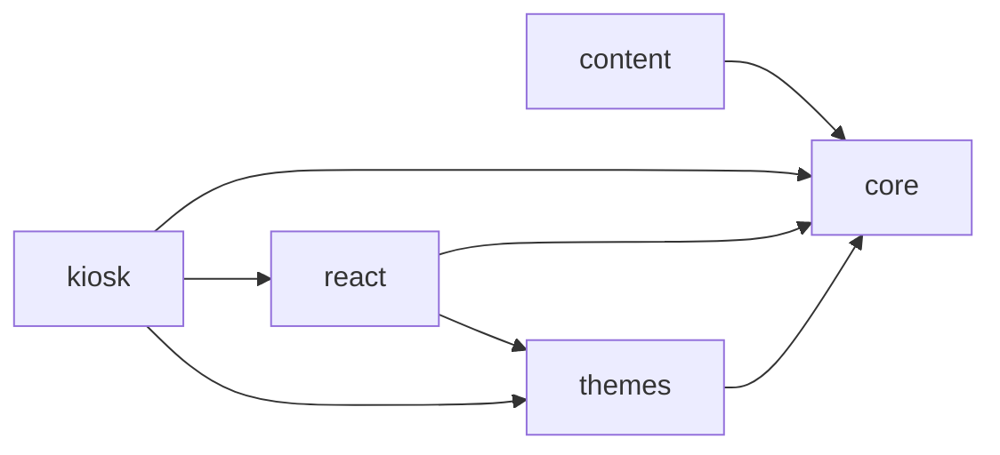
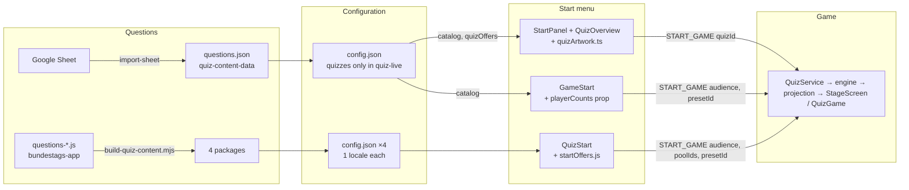

# A. Current architecture

State as of 2026-09-14. All six repositories were read locally; nothing here is taken from memory or from documentation alone unless marked "(docs)".

## A.1 Repositories

| Repository | Branch @ HEAD | Role | `@hfroemmel/quiz-*` range | Tests (baseline, H Phase 0) |
|---|---|---|---|---|
| `hfroemmel/quiz` | `main` @ `7e63233` | the five libraries + dev harness + E2E | packages at 0.14.0 (published up to 0.15.3) | vitest 279, Playwright 100 (98 green) |
| `hfroemmel/quiz-live` | `main` @ `698b149` | stage evening: server, persistence, operator/moderator/stage/play clients, Electron shell | `~0.14.0` (README says `^0.3.0`) | vitest 72 (68 green), Playwright 64 |
| `hfroemmel/bundestags-app` | `new-quiz` @ `084a545c` | CRA + Electron game collection; the quiz is one page | `0.x` (lock 0.15.3, installed 0.6.1) | Playwright 25 (24 green) |
| `hfroemmel/quiz-standalone` | `main` @ `710bd12` | Electron kiosk, one window, no server | `0.x` | Playwright 4 (Electron, not run here) |
| `hfroemmel/app-collection` | `main` @ `56c6d5f` | Electron game collection with the quiz embedded | `0.x` | vitest 3, Playwright 3 (not run here) |
| `hfroemmel/quiz-content-data` | `main` @ `5fb94c8` | editorial content (201 questions, config, assets in LFS) | `^0.1.0` (quiz-content) | `quiz-content validate` in CI |

## A.2 Packages

Fixed versions via Changesets; published privately to GitHub Packages (`docs/veroeffentlichung.md`).

| Package | Depends on | `exports` | Public surface (`src/index.ts`) |
|---|---|---|---|
| `quiz-core` | `zod` | `.` | `contracts/*` (schemas: content, config constants, commands, state, joker, view models), `engine/*`, `runtime/*` |
| `quiz-content` | core, zod | `.` + bin `quiz-content` | `validate`, `package` (build, manifest), `report`, `csv`, `sheetImport`, `legacy/{parseLiteral,migrate}`; CLI `build`, `pull`, `validate`, `fetch`, `import-sheet`, `generate-demo-assets`, `migrate-legacy`, `migrate-v2` (`packages/content/src/cli/`) |
| `quiz-themes` | core | `.`, `./palette.css`, `./fonts.css`, `./controls.css` | `palettes` (dark, bright, ui, start, brightStart, quizSelect, kids tokens), `sceneTheme` (`themeForView`), `paletteStylesheet` (`themeVariables`) |
| `quiz-react` | core, themes; peer react | `.`, `./styles/stage.css`, `./styles/motion.css`, `./assets/*` (+ `styles.css`) | `QuizScene`, `StageScreen`, `StageHeader` (+ slots), `Counter`, `Score`, `jokerIcons`, `soundCues`, `texts` (`standardTexte`, `texteFuer`), `useAudioUnlock`, `stageTheme` (`useStageTheme`), `brandAssets` (`brandWordmarkUrl`), `useQuizConnection`, `useQuizRuntime`, `useQuizSnapshot`, `useRevealClock`, `AnimationClip`, `Confetti`, `answerState`, transition registry, `animationPresets` |
| `quiz-kiosk` | core, react, themes; peer react | `.` (+ `styles.css`) | `QuizGame`, `GameStart` |

Dependency direction today (no cycles, no host dependency):

### Central modules of `quiz-core`

| Area | Files | What they own |
|---|---|---|
| contracts | `contracts/content.ts` (question, config, package schemas), `contracts/config.ts` (`scoringRules`, `gameTiming`, `revealGrid`, `selfServiceTiming`, `selectionTuning`, `contentThresholds`), `contracts/commands.ts` (25 command types, `roleMayIssue`), `contracts/state.ts` (`gamePhases`: idle, pause-screen, question-presented, video, buzzer-open, answer-locked, attempt-feedback, second-chance, reveal-ready, reveal-running, reveal-paused, solution, result, aborted; `flowProfiles = ['operated','self-service']`), `contracts/joker.ts` (`jokerTypes = ['fiftyFifty','audience']`) | the language every host and package speaks |
| engine | `engine.ts` (`reduce`), `scoring.ts` (`pointsForCorrectAnswer`, `applyScoreDelta`, `determineResult`), `buzzer.ts` (`evaluateBuzz`, `eligibleOpponent` = second chance), `reveal.ts` (reveal clock, tile plan), `joker.ts` (draw, 50:50 suitability, audience joker, blocked commands), `selection.ts` (`selectQuestionForSlot`, `poolForGame`, repetition window, `shuffleOptionOrder`), `allowedCommands.ts`, `events.ts` (`deriveQuizEvents`), `quizModes.ts` (`resolveQuizMode`) | every rule that exists |
| projection | `projection.ts` (`projectPublic/Player/Moderator/Operator`, `sceneForPhase:97`, `spracheFuer:572`, `resolveTheme:615`, `quizOffers:652`, `buildCatalog:659`) | role-specific view models |
| runtime | `quizService.ts` (`QuizService`: dispatch, persistence via `QuizStorePort`, timers), `contentService.ts`, `localRuntime.ts` (`LocalQuizRuntime`: in-process service + memory/host store), `remoteRuntime.ts` (`RemoteQuizRuntime`: WebSocket client), `hotfix.ts` | how a host obtains a running quiz |

## A.3 Hosts and what each must know

| Host | Runtime | Components | Props / values it supplies | Package internals it reads |
|---|---|---|---|---|
| quiz-live operator | `useQuizConnection('operator')` → `RemoteQuizRuntime` | `StageScreen variant="preview"`, own chrome | theme via `themeForView`/`themeVariables`, `useStageTheme` | 22 distinct `view.*` fields incl. nested `diagnostics`, `joker.sequence`, `editableQuestion` (survey §2.1) |
| quiz-live stage | `useQuizConnection('stage')` | `StageScreen`, host `QuizOverview` | artwork table, `jokerHeaderSlots` | `view.scene`, `view.quizOffers`; literal class string `stage stage--default stage--dark` |
| quiz-live moderator | `useQuizConnection('moderator', code)` | own layout | session code | 12 `view.*` fields |
| quiz-live `/play` | package `QuizGame` from the router | — | `?audience=`, `?idle=` | none |
| quiz-standalone | `LocalQuizRuntime({ quizPackage, restoreFrom, persist })` | `QuizGame` | `audience`, `playerCounts=[1]`, `idleTimeoutMs`, `soundEnabled?`, `zoom?`, `locale?` | manifest shape (asset map), `[data-game-start]` in tests |
| app-collection | same, in `QuizSession` | `QuizGame` | as above minus `playerCounts`, plus `onFinished`, `onExit` | same |
| bundestags-app | same, in `session.js` + media monkey-patch | `QuizGame` (kids) / own `QuizStart` (adults) | `audience`, `soundEnabled`, `idleTimeoutMs`, `onExit`, `zoom`, `overlay` | five snapshot fields, five data attributes hidden by CSS, `runtime.content.assetUrl`, `--stage-*` and `--color-*` variables |

Server side (quiz-live only): `packages/server` composes `QuizStore` (SQLite) + `ContentService` + `QuizService` (`createRuntime.ts:51-79`), serves `/media/<id>` with range support and placeholder SVGs, enforces loopback for operator and player and a session code for the moderator (`network.ts:43-75`), elects an audio master among stage/operator sockets (`audioMaster.ts`).

## A.4 Question models in use

| Model | Where | Notes |
|---|---|---|
| canonical `questionSchema` v2 | `packages/core/src/contracts/content.ts:131-168` | `translations` per locale; choice questions 2–4 options |
| the same, as data | `quiz-content-data` (201, de-DE only), `quiz-live/content/source` (230 incl. test questions), `quiz-standalone`/`app-collection` (29 fixtures) | no `translations` used anywhere yet |
| legacy `.js` arrays | `bundestags-app/src/components/Quiz/content/source/questions-*.js` (443) | `question`, `option_1..3`, `img_filename`, `img_credits`, `info` \| `level`, `category` |
| generated app packages | `bundestags-app/src/components/Quiz/content/{adults,kids}-{de,en}` | schema v2 plus a non-schema `details` field |
| Google-Sheet rows | `packages/content/src/sheetImport.ts` (`SheetMapping`) | one locale; documented in `quiz-content-data/README.md` |

## A.5 Configuration

`quizConfigSchema` (`content.ts:423-460`): `questionsPerGame`, `difficulties`, `categories`, `pools`, `themes` (id, skin, logo), `presets` (slots with filters), `audiences` (theme, start visual/title/description, allowed presets), `quizzes?` (`quizModeSchema:363-397`), `locales?`, `interfaceStrings?`. Rule values are constants (`contracts/config.ts`). `START_GAME` (`commands.ts:38-76`) takes either `quizId` or `audience` (+ `poolIds`, `presetId`), `playerCount`, `playerLabels`, `flowProfile`.

Who fills what today:

| Field | quiz-content-data | quiz-live | standalone / collection | bundestags-app packages |
|---|---|---|---|---|
| `quizzes` | – | 5 | – | – |
| `locales` | – | – | – | 1 per package |
| `interfaceStrings` | – | – | – | de: 8 keys, en: 35 keys |
| player counts | – (always duel) | – (always duel) | prop | host `PLAY_MODES` |
| artwork | – | host table | – | host files |
| idle timeout | – | `?idle=` | config file → prop | constant → prop |

## A.6 Theme system

`packages/themes/src/palettes.ts` → `palette.css` at build. Families: `--color-*` (stage, `darkPalette`/`brightPalette:101`), `--ui-*` (operator chrome), `--start-*` (`startPalette`, `brightStartPalette:375`, scoped to `[data-quiz-game][data-theme='bright']`), `--quiz-select-*` (`:199`, offer cards incl. five house colours), `--kids-*` (`tokens.css`). `themeForView(view)` picks the scene theme from `view.theme.skin`; `themeVariables(theme)` emits inline custom properties. Bright/dark is a per-window `localStorage` preference (`packages/react/src/presentation/stageTheme.ts`), never applied to kids. Fonts in `fonts.css`; kids art referenced by `url()`/`border-image` in package CSS; wordmark exported from `brandAssets.ts`. Host copies: `bundestags-app/…/QuizStart.scss:27-41`; quiz-live consumes tokens only (zero colour literals in `apps/web/src`).

## A.7 Start menus

| Menu | Component | Model source | Extra host knowledge |
|---|---|---|---|
| kiosk | `packages/kiosk/src/game/GameStart.tsx` (audience presets, player count, language, settings, exit) | `catalog` + props | `playerCounts` prop |
| Bundestags-App adults | `src/components/Quiz/QuizStart.js` (three cards, two modes, green action, notice) | `startOffers.js` | ids = pool ids; texts via react-i18next; colours copied |
| quiz-live | operator `StartPanel.tsx` (radio groups quiz + difficulty), stage `QuizOverview.tsx` (inert cards) | `view.catalog.quizzes`, `view.quizOffers` | `quizArtwork.ts` |

## A.8 The flow today: Questions → Configuration → Start Menu → Game

Three menus send three shapes of the same command; two pipelines produce the same package format; one configuration field (`quizzes`) is filled in one of five content sets.

## A.9 Tests and docs

- quiz: vitest 279 (core 200, content 60, themes 4, react 17, kiosk 0); Playwright specs `embedding` 4, `joker` 3, `kids-quiz` 17, `kids-theme` 13, `presentation` 23, `touch-play` 33 (parameterised to 100 runs) with screenshot baselines; harness routes `/`, `/play`, `/shell` (`harness/src/main.tsx:44-68`).
- quiz-live: vitest 72 in `packages/server/test` (persistence has none); Playwright 63 declared / 64 run across `game-flows`, `joker`, `live-presentation`, `operator-setup`, `stage-overview`, `video`.
- bundestags-app: Playwright 18 bodies / 25 runs in `test/e2e/quiz.spec.mjs`.
- standalone 4 / app-collection 3 + 3, all Electron-driven.
- docs: 22 German Markdown files in `quiz/docs/` (architecture, state machine, commands, content import/package/takeover, design system, animations, joker, kids view, publishing, migration status, multi-context architecture, known limitations, operator guide, screens); plus one English `bundestags-app/docs/quiz.md`.
