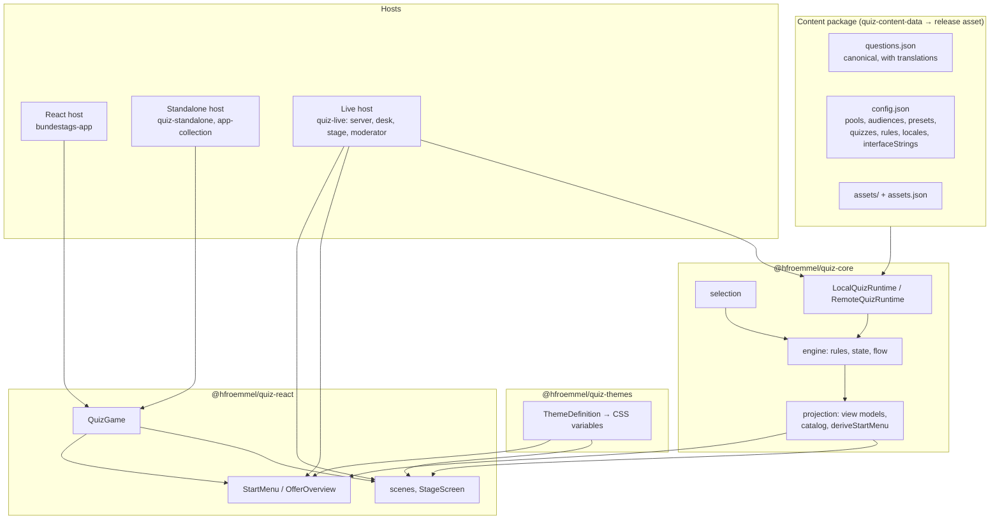
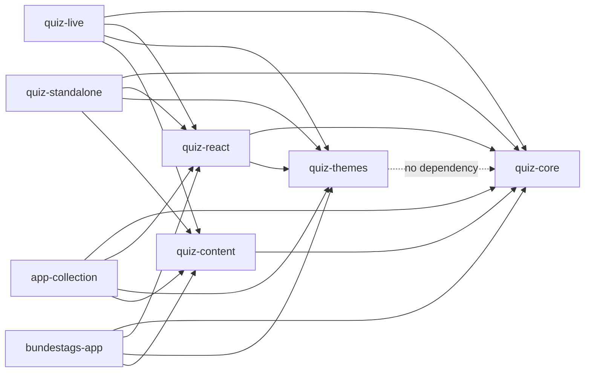

# C. Target architecture

Principle from the brief: **Content + Rules + Theme + Host = Quiz**, with the engine untouched and hosts free to differ where their runtime differs (a stage evening is not a foyer kiosk). Every block below names one owner; a concern that is listed under two blocks today is the finding, not the target.

| Block | Owner (package / repo) | Responsibility in the target | Today's deviation (see B) |
|---|---|---|---|
| **Quiz Core** | `quiz-core` | contracts (schemas, commands, view models), engine, runtimes, projection. No DOM, no CSS, no host names. | doc comments and role vocabulary name the live host (`Saal`, `Buehnenbetrieb`, `besidePlayer` "Jokerkarte des Live-Quiz"); German identifiers |
| **Quiz Rules** | `quiz-core/engine` (unchanged) + `config.rules` (new, D.5) | scoring, second chance, jokers, reveal, timings, idle. The engine reads values from the package configuration with today's constants as defaults. | values are constants (`contracts/config.ts`); idle timeout is a kiosk prop |
| **Quiz State** | `quiz-core/engine` + `QuizStorePort` | state machine, persistence port. Hosts implement the port (SQLite in live, JSON snapshot in standalone/app-collection, `localStorage` in the app). | fine; three snapshot persistences are legitimately host-specific |
| **Question Model** | `quiz-core/contracts/content.ts` | `questionSchema` v2 with `translations`. One corpus per project, language attached. | Bundestags-App keeps a legacy corpus per language plus a host-only `details` field |
| **Question Import** | `quiz-content` | template, workbook/CSV/sheet import, legacy migration, validation, build, pull. Only place that knows customer formats. | a second pipeline in `bundestags-app/scripts/build-quiz-content.mjs` |
| **Question Selection** | `quiz-core/engine/selection.ts` (unchanged) | pools, audiences, slot filters, repetition avoidance. Subsets are `poolIds` + preset filters; no query language. | none |
| **Quiz Configuration** | content package `config.json` | single source: quizzes (with `playerCounts`, artwork, order), presets, audiences, themes by id, locales, interface strings, rules. Declarative, serialisable, zod-validated (§19 configurator constraint). | `playerCounts` as prop; offers duplicated in `startOffers.js`; artwork in `quizArtwork.ts`; 35 English strings in a build script |
| **Quiz UI** | `quiz-react` | scenes, stage, feedback, result, sounds; `QuizGame` (start → game → result) for self-service hosts. | `QuizGame` lives in a fifth package (`quiz-kiosk`) with one consumer pattern |
| **Start Menu** | `quiz-core` (model: `deriveStartMenu`) + `quiz-react` (`StartMenu`, `OfferOverview`) | model from configuration; UI ported from the Bundestags-App reference; the live desk keeps its own form on the same model. | three menus with three data sources |
| **Theme System** | `quiz-themes` | `ThemeDefinition` (tokens, typography, assets) → scoped CSS variables; `bright`, `dark`, `kids` shipped; `skin` chosen by content. | five token families, one bright block scoped to `[data-quiz-game]`, house colours of five quizzes in the library, copies in the app |
| **React Host** | `bundestags-app/src/components/Quiz` | session (which quizzes, language), mount, exit, details slot content, app chrome. | start screen, pipeline, media patch, five CSS suppressions, MutationObserver |
| **Standalone Host** | `quiz-standalone`, `app-collection` (+ shared `quiz-host-electron`) | Electron main process (package serving, snapshot file, config file), window, exit/idle wiring. | 13 byte-identical files across the two repos; `playerCounts={[1]}` in code |
| **Live Host** | `quiz-live` | server (HTTP/WS, SQLite, access rules, audio master), operator desk, moderator view, stage window, Electron shell. Stays a separate context by decision. | artwork table, joker presentation (~600 lines) that the packages could carry, README drift |

## C.1 What deliberately stays host-specific

- The **operator desk form** (`StartPanel`) and everything the moderator sees: the live evening has an operator, the kiosk does not. Both consume the same `StartMenuModel`, but their UI is not unified.
- **Persistence adapters**: SQLite with audit and hotfix tables (live) vs. a snapshot file (standalone) vs. `localStorage` (app). The port is shared; the implementations are not.
- **Media transport**: `/media/<id>` over HTTP (live), `app://quiz/media/<id>` (Electron), webpack asset URLs (CRA). The runtime gets a `media` resolver option instead of a monkey-patch; the resolvers stay in the hosts.
- **App chrome** of the game collections (control bar, tiles, colours of the collection menu).
- **Hardware buzzers** (`useBuzzerKeys`) and the LAN access matrix.
- The **kids world** as a layout variant: a `skin`, not a theme parameter set (§12).

## C.2 Dependency direction after the refactoring

`quiz-kiosk` is gone (merged into `quiz-react`, H Phase 8). No package depends on a host; no host re-implements a package concern. The `@hfroemmel/quiz`, `@hfroemmel/quiz/react`, `@hfroemmel/quiz/live` single-package layout suggested in §9 was considered and rejected: four packages with fixed versions already give one install line per host, the live server must not pull React, and the content CLI must not pull the engine's browser code. Sub-path exports inside one package would reintroduce exactly the bundling constraints the split solved in migration phase 5.

## C.3 Configurator readiness (§19)

Everything a future configurator would write is already a JSON document validated by zod (`quizConfigSchema` + the additions in D): quizzes, subsets, modes, rules, texts, theme *reference*. The theme *values* are a second JSON document (`themeDefinitionSchema`, G.2). Neither requires React code or callbacks. The only non-serialisable inputs left are the host's mount props (`runtime`, `media`, `onExit`), which a configurator never needs to produce.
