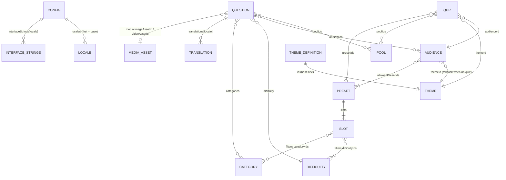

# D. Target data model

Every model below answers four questions explicitly: what it is, where it lives today, what changes, and how it carries more than one language. Field names are given in English; the reasons for each field are traced to an existing behaviour so that nothing is invented.

Relations at a glance:



## D.1 Canonical question

**Today.** `questionSchema` in `packages/core/src/contracts/content.ts:131-168` already is a canonical, language-aware model: `id`, `repetitionGroupId?`, `poolIds[]`, `audiences[]`, `difficulty`, `categories[]`, `tags[]`, `locale`, `prompt`, `questionType`, `evaluationMode`, `options?`, `correctOptionId?`, `acceptedAnswerText?`, `media?`, `explanation?`, `translations?`, `enabled`. Translations replace `prompt`, single `options` by id, `acceptedAnswerText`, `explanation` and `media` per locale (`questionTranslationSchema`, `content.ts:117-129`). Choice questions need two to four options (`contentThresholds.minChoiceOptionCount/maxChoiceOptionCount`, `packages/core/src/contracts/config.ts:150-151`).

Three catalogues exist against this one schema:

| Catalogue | Format | Questions | Languages | Deviations from canonical |
|---|---|---|---|---|
| `quiz-content-data/content/source/questions.json` | schema v2 | 201 | de-DE only, no `translations` | none |
| `quiz/content/source/questions.json` | schema v2 fixtures | test set | de-DE (+ en-GB fixtures) | none |
| `bundestags-app/src/components/Quiz/content/source/questions-{adults,kids}-{de,en}.js` | legacy (`question`, `option_1..3`, `img_filename`, `img_credits`, `info` / `level`, `category`) | 162 + 168 + 60 + 53 | one file per language; English and German sets differ in size and content | three options; `option_1` is the answer by position; `info` becomes a host-only `details` field that the engine strips (`scripts/build-quiz-content.mjs:250-296`) and the host re-attaches by prompt text (`src/components/Quiz/content/index.js:50-70`); adults have no difficulty (`standard`) |

Only 13 of the 218 distinct app prompts also occur in the 201 questions of `quiz-content-data` (prompt comparison, normalised). The app catalogue is therefore a second corpus, not a copy.

**Target.** Keep `questionSchema` unchanged. Two additions to the *pipeline*, none to the engine:

1. `explanation.details` receives the app's `info`. Visibility stays a *projection* decision: today `details` is internal to operator and moderator (`docs/quizpaket.md`, "Von `explanation` wird ausschliesslich `summary` oeffentlich gezeigt"). The self-service flow profile may show `details` after the solution; this becomes a rule flag (`rules.showDetailsAfterSolution`, see D.5) instead of a host lookup by prompt text.
2. Every legacy corpus is imported with `quiz-content migrate-legacy` (which already maps `option_1`, `img_filename`, `img_credits`, `info`, `level`, `packages/content/src/legacy/migrate.ts:126-267`) and then lives in `quiz-content-data`.

**Languages.** One question, one row, many `translations`. The alternative the app uses today (one corpus per language) is rejected because a language switch would change the question set (162 vs 168 adult questions) and repetition avoidance would treat the German and the English version of the same question as different questions. The pipeline validates that a translation cannot add or drop an option (`packages/content/src/validate.ts`, translation rules; see A.2).

## D.2 Excel template (customer format)

The customer-facing format is one workbook with fixed sheets, produced by a new command `quiz-content template --locales de-DE,en-GB --out quiz.xlsx` and read by `quiz-content import --xlsx quiz.xlsx` (or `--csv` per sheet as the fallback). It generalises the existing Google-Sheet import: the column mapping of `packages/content/src/sheetImport.ts:24-70` (`SheetMapping`: `spalten`, `vorgaben`, `werte`) already covers everything but the per-locale columns, so the importer is an extension, not a rewrite.

Sheet `Questions`, one row per question:

| Column | Type | Required | Dropdown / rule | Canonical field |
|---|---|---|---|---|
| ID | text | yes (generated if empty) | unique, lower-case, `a-z0-9-` | `id` |
| Pool | list | yes | values of sheet `Pools` | `poolIds` |
| Audience | list | yes | values of sheet `Audiences` | `audiences` |
| Difficulty | single | yes | values of sheet `Difficulties` | `difficulty` |
| Category | list | no | values of sheet `Categories` | `categories` |
| Type | single | yes | text-choice, image-choice, person, image-reveal, video-then-question | `questionType` |
| Question (de-DE) | text | yes | non-empty | `prompt` |
| Answer A..D (de-DE) | text | A and B for choice types | two to four filled | `options[].text` |
| Correct | single | for choice types | A, B, C, D | `correctOptionId` |
| Accepted answer (de-DE) | text | for manual evaluation | `;`-separated | `acceptedAnswerText` |
| Explanation (de-DE) | text | no | | `explanation.summary` |
| Details (de-DE) | text | no | | `explanation.details` |
| Image | text | for image types | file name in sheet `Media` | `media.imageAssetId` |
| Video | text | for video type | file name in sheet `Media` | `media.videoAssetId` |
| Image credit | text | warning if empty for images | | media asset `credit` |
| Source | text | no | | `explanation.source` |
| Repetition group | text | no | | `repetitionGroupId` |
| Active | single | yes | yes / no | `enabled` |
| Question (en-GB), Answer A..D (en-GB), Accepted answer (en-GB), Explanation (en-GB), Details (en-GB), Image (en-GB) | text | no | empty cell = fall back to base locale | `translations['en-GB']` |

Every locale registered in `Config` adds the same column group with its locale tag in the header. This keeps one row per question (D.1) and lets the importer build `translations` mechanically. Options are translated by column letter, which maps to the option id, so a translation can never move the correct answer.

Supporting sheets, each `id`, `label (de-DE)`, `label (en-GB)`, ...: `Pools`, `Audiences` (plus `theme`, `presets`), `Difficulties`, `Categories`, `Presets` (with `slots` as rows: `slot`, `difficulty`, `category`, `type`), `Quizzes` (see D.3), `Config` (`questionsPerGame`, `locales`), `Media` (file name, kind, credit, source URL), `Interface texts` (key, value per locale).

Validation on import (all existing rule families of `quiz-content validate` apply unchanged): unknown dropdown value, correct letter without text in that column, image name not in `Media`, a translation with an option letter that has no base text, missing base-locale cell.

## D.3 Quiz definition

**Today.** `quizModeSchema` (`content.ts:363-397`): `id`, `label`, `labels?`, `subtitle?`, `subtitles?`, `audienceId`, `themeId`, `poolIds?`, `presetIds`, `defaultPresetId?`. Difficulty choice is derived (`quizSupportsDifficulty`, `content.ts:399`). Used by quiz-live only (`quiz-live/content/source/config.json`, five quizzes). The bundestags-app keeps its own list `QUIZ_OFFERS` and `PLAY_MODES` in `src/components/Quiz/startOffers.js`, and the kiosk takes `playerCounts` as a component prop.

**Target.** `quizModeSchema` grows by the facts the start menus hard-code today:

```ts
quizzes: [{
  id, label, labels, subtitle, subtitles,        // unchanged
  audienceId, themeId, poolIds, presetIds, defaultPresetId, // unchanged
  playerCounts: [1, 2],                          // was: kiosk prop / app PLAY_MODES
  artworkAssetId: 'art-bundestag',               // was: quizArtwork.ts (live) / images/start (app)
  emphasis: 'wide' | 'regular',                  // was: `wide` flags in both hosts
  order: 10                                      // menu order; was: array order in three places
}]
```

`flowProfile` stays a host decision (`START_GAME.flowProfile`, `packages/core/src/contracts/commands.ts:75`): whether a human operates the game is a property of the installation, not of the content.

**Languages.** `labels`/`subtitles` per locale already exist. Artwork is locale-neutral by convention; a locale-specific motif is a different quiz.

## D.4 Filters and subsets

Unchanged: presets with slots and filters (`difficultyPresetSchema`, `questionSlotRuleSchema`, `content.ts:222-282`), pools as the content axis, audiences as the fitness axis. The only addition is documentation: a "subset" is always expressed as `poolIds` on the quiz plus slot filters on the preset. No new filter type is introduced; every filter maps to `packages/core/src/engine/selection.ts`.

## D.5 Rules configuration

Only rules that exist in the engine are configurable. The values live in `packages/core/src/contracts/config.ts` as constants today:

| Rule | Constant today | Engine site | Configurable in target |
|---|---|---|---|
| points for first correct answer | `scoringRules.firstAnswerPoints` (100) | `engine/scoring.ts` | yes, per quiz package (`rules.scoring`) |
| points for second chance | `scoringRules.secondChancePoints` (50) | `engine/scoring.ts` | yes |
| manual adjustment step, minimum score | `scoringRules.manualAdjustmentStep`, `minimumScore` | `engine/scoring.ts` | yes |
| feedback and solution timings | `gameTiming.*` | `engine/engine.ts` timers | yes (bounded) |
| image reveal duration and grid | `gameTiming.imageRevealDurationMs`, `revealGrid` | `engine/reveal.ts` | duration yes, grid no |
| self-service lead-ins | `selfServiceTiming.*` | `engine/engine.ts` | yes |
| selection window | `selectionTuning.*` | `engine/selection.ts` | no (fairness tuning, stays code) |
| jokers | see A.4 | `engine/joker.ts` | on/off per quiz |
| idle timeout | kiosk prop `idleTimeoutMs` | `packages/kiosk` | yes, `rules.idleTimeoutMs` |
| details after solution | host-only today | new projection flag | yes |

Shape: `config.rules?: { scoring?, timing?, jokers?: { enabled }, idleTimeoutMs?, showDetailsAfterSolution? }`, validated against the same bounds the constants document. Defaults equal today's constants, so a package without `rules` behaves exactly as today. This satisfies the "no new rules" constraint: nothing is added that the engine does not already do.

## D.6 Theme configuration

Content names a theme id and skin (`quizThemeSchema`, `content.ts:292-300`); the host provides the theme values (`@hfroemmel/quiz-themes`). Target: the host passes a `ThemeDefinition` object (G.2) whose `id` matches `themes[].id` of the content. The relation is by id only, so content packages stay colour-free (as today since schema v2).

## D.7 Locale handling

| Layer | Today | Target |
|---|---|---|
| available languages | `config.locales` (first = base) `content.ts:449` | unchanged |
| entity labels | `labels`, `subtitles`, `startTitles` per locale | unchanged |
| question texts | `translations[locale]` | unchanged; Excel columns per locale |
| interface strings | German defaults in `quiz-react`, overrides in `config.interfaceStrings[locale]` `content.ts:459` | defaults keyed per locale in the package (`de-DE`, `en-GB` shipped), overrides unchanged |
| active locale | engine state, `SET_LOCALE` | unchanged; hosts pass an initial `locale`, the package menu offers the switch when `locales.length > 1` |
| host chrome (menus outside the quiz) | react-i18next in the bundestags-app | stays host-side; the quiz receives `locale` once |

The rule for every model: **one locale-neutral record with per-locale texts attached**. No model in this document has a second record per language.
