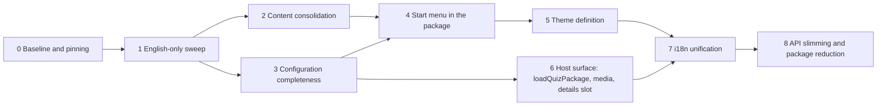

# H. Migration plan

Ground rules from the brief: the system stays runnable after every phase; behaviour is preserved and proven by the existing suites; no phase mixes a structural change with a rename; every phase names the packages it touches, what changes, dependencies, risks, tests and the visible result. Release cadence stays "fixed versions, 0.x" until Phase 8.

## Phase 0 – Baseline and pinning

**Goal.** A recorded, reproducible green state and fixed package ranges in every host, so every later phase can prove "behaviour preserved".

**Baseline as measured on 2026-09-14** (all six repositories at the HEADs listed in A.1):

| Repository | Unit | E2E | Red at baseline (pre-existing, cause known) |
|---|---|---|---|
| quiz `7e63233` | vitest 279/279 (20 files) | Playwright 98/100 | `kids-theme.spec.ts:103` (mascot overlaps the right buzzer since the user's `scale: 0.8` footer change in `Stage.module.css`), `touch-play.spec.ts:652` (zoom no longer read from the scene after the same change) |
| quiz-live `698b149` | vitest 68/72 (6 files) | Playwright 64/64 | `packages/server/test/media.test.ts` ×3 (`GET /media/<id>` answers 404 instead of 200/206/416: the test fixture asset is missing from the built package), `service.test.ts` "bevorzugt im naechsten Spiel noch nicht gespielte Fragen" (expected `[]`, got one repeated question: selection window vs. fixture size) |
| bundestags-app `084a545c` (new-quiz) | jest: 1 suite fails with 0 tests (CRA default `App.test.js`, not quiz) | Playwright 24/25 | `quiz.spec.mjs:481` "scales with the display size of the table" measures `0.7 / 0.9` because `STAGE_ZOOM` was set to `0.9` in commit `0c81f63a` while the test assumes the host runs at 1 |
| quiz-standalone `710bd12` | none | 4 (Electron; not runnable here: no `node_modules`) | unknown here |
| app-collection `56c6d5f` | vitest 3 | 3 (Electron; not runnable here) | unknown here |
| quiz-content-data `5fb94c8` | `quiz-content validate` (CI) | none | media missing (LFS), see README |

**Versions.** Published packages up to 0.15.3; quiz repo at 0.14.0 → 0.15.x; quiz-live devDependency `~0.14.0`; standalone, app-collection and bundestags-app `0.x`; bundestags-app lockfile 0.15.3 but **installed 0.6.1** (`node_modules/@hfroemmel/quiz-core/package.json`, no `quizModeSchema` in `dist/index.js`); quiz-content-data `^0.1.0`.

**Changes.** Fix or explicitly quarantine-with-issue the six red tests above (they are not flaky: all reproduce). Pin every host to `~0.15.3` (tilde, not `0.x`; the reasoning in `docs/veroeffentlichung.md` for `0.x` was "one hand, lockstep", which no longer holds once phases ship breaking minors). Add `content:build` to the bundestags-app CI so the four packages are regenerated from source instead of committed. Record the table above in each repo's README "Checks" section.

**Packages touched.** none. **Hosts.** all five. **Risk.** low. **Tests.** all suites green or listed. **Result.** the acceptance criterion for every later phase.

**Status: done** (branch `refactor` in all six repositories). The six red tests were fixed without loosening an assertion: the touch stage keeps the scene above the fixed footer and reads the zoom again (`Stage.module.css`), quiz-live got the 19 missing fixture assets plus a unique id for the second video question and a repetition test that no longer assumes a single candidate, and the bundestags-app zoom test now measures against the host's own `--quiz-start-zoom`. Every host pins `~0.15.3`, quiz-live stays `~0.14.0` until it is migrated. Measured green: quiz 279 unit + 100 E2E, quiz-live 72 unit + 64 E2E, bundestags-app 25 E2E. Lockfiles were not re-resolved here - the registry is unreachable from this environment.

## Phase 1 – English-only sweep

**Goal.** No German in identifiers, comments, test names, fixtures or repo documents; German remains only in locale files and content.

**Scope (files with German comments or identifiers, uniform heuristic, string literals excluded):**

| Repository | Source files | with German | German test names | Markdown |
|---|---|---|---|---|
| quiz | 161 | 153 | 248 | 31 files, ~31 800 words (`docs/`, READMEs, changesets) |
| quiz-live | 73 | 68 | 115 | 5 files, ~1 750 words |
| quiz-standalone | 15 | 15 | 4 | 1 file, ~750 words |
| app-collection | 18 | 18 | 6 | 1 file, ~660 words |
| bundestags-app (quiz paths) | 11 | 0 (one `$hell` variable, one "fassung" word) | 0 | `docs/quiz.md` already English |
| quiz-content-data | 0 | 0 | 0 | 1 file, ~900 words |

Exported German identifiers that hosts import and therefore need a deprecation alias for one release: `uebersetzteBeschriftung` (`packages/core/src/contracts/content.ts:94`), projection helpers `spracheFuer`, `beschriftung`, `untertitel`, `fragenTextFuer`, kiosk `klemmeZoom`, host-side `Betriebsangaben`, `bauePaket`, `ladePaket`, `liesStand`, `schreibStand` (preload bridge names cross the Electron IPC boundary in standalone and app-collection).

**Changes.** Rename identifiers with codemods (ts-morph), rewrite comments, translate test names and docs, keep the *content* of comments (they carry design decisions). Locale JSON values, `content/**` and expected UI strings in tests stay German. Translated docs keep their file names for one release with a one-line redirect, then are renamed.

**Packages touched.** all five. **Hosts.** all. **Dependencies.** Phase 0. **Risk.** medium (volume, ~150 files in quiz alone); mitigated by codemods and by doing it as one PR per repository with no behaviour change. **Tests.** full suites; screenshot baselines unchanged. **Result.** every later diff is readable without a dictionary and reviewers can enforce "English only" in CI with the heuristic script from this analysis.

**Status: done.** Identifiers were renamed through the TypeScript language service so that every reference followed: 562 symbols in quiz, 175 in quiz-live, 109 in quiz-standalone, 139 in app-collection. Renamed package exports keep a deprecated alias for one release, and the sheet-import CLI still accepts the former mapping keys `spalten`, `vorgaben`, `werte`. Comments, test titles, CI notes, SQL notes in the migrations and the documents are English; the harness serves the package under `/quiz-package/` and three harness files carry English names. German stays where it is content or user-visible: locale files, operator and player labels, the expected-text assertions that match them, the server's console banner, the editorial column names and the difficulty aliases `leicht/mittel/schwer`. The heuristic now reports German outside string literals in 6 of 154 quiz files, 13 of 73 quiz-live files and 2 of 15 and 18 files in the two Electron apps - every one of them a quoted UI label. Suites after the sweep: quiz 279 unit + 100 E2E + package verification, quiz-live 72 unit + 64 E2E, both Electron apps unchanged (no dependencies installable here). The configuration file of app-collection is now `collection.config.json`; the former name is still read so that a device set up earlier keeps its settings.

## Phase 2 – Content consolidation

**Goal.** One import pipeline, one canonical corpus repository, one customer format.

**Changes.**
- `quiz-content`: `template` (Excel workbook, D.2) and `import --xlsx|--csv` with per-locale column groups; reuse `SheetMapping`; `migrate-legacy` learns `img_credits` → asset `credit` and `info` → `explanation.details`, three-option questions pass (`minChoiceOptionCount` is 2).
- `quiz-content-data`: import the Bundestags-App corpus (162+168 adults, 60+53 kids) as new pools/audiences with `translations` where a German and an English row are the same question (editorial pairing; unpaired rows stay single-locale), images into LFS with credits.
- bundestags-app: `scripts/build-quiz-content.mjs` and `src/components/Quiz/content/source/*.js` are deleted; `content.lock.json` + `quiz-content pull` replace the four committed packages; the host selects the audience by filtering `quizzes` (not by loading a different package).

**Packages touched.** content, core (schema unchanged; `explanation.details` now populated by the pipeline). **Hosts.** bundestags-app, quiz-content-data. **Dependencies.** Phase 1 (English CLI). **Risk.** editorial pairing of the two language corpora is manual work; the 21 asset-reference errors in quiz-live's content must be fixed rather than re-stamped. **Tests.** `quiz-content validate` in both profiles; workbook round-trip unit tests (template → fill → import → identical `questions.json`). **Result.** Step 1–2 of the practice test take one route.

## Phase 3 – Configuration completeness

**Goal.** Everything a start menu shows is in the quiz package configuration.

**Changes.** `quizModeSchema` + `playerCounts`, `artworkAssetId`, `emphasis`, `order` (D.3); `config.rules` (D.5) with defaults equal to today's constants; `deriveStartMenu()` in core (F.2); server validation in quiz-live accepts the new fields; `QuizGame` reads `playerCounts` from the selected quiz when present (prop stays as fallback for one release).

**Packages touched.** core, content (validation of the new references). **Hosts.** quiz-live (config lines), standalone/app-collection (config lines instead of the `playerCounts` prop). **Dependencies.** Phase 1. **Risk.** low; additive. **Tests.** core unit tests for `deriveStartMenu` (empty `quizzes`, single audience, unavailable pool, locale fallback); quiz-live `quizModes.test.ts` extended. **Result.** a new quiz is one configuration entry in every host.

**Status: done.** `quizzes[]` carries
`playerCounts`, `artworkAssetId`, `emphasis` and `order`; `config.rules` carries
scoring, the phase timings, the joker switch, the idle timeout and the details
flag, each defaulting to the constant used until now. The engine reads scoring
and the joker switch through its context instead of importing constants, and
`resolveRules` is the single place that decides what "not configured" means.
`deriveStartMenu(config, catalog, locale)` returns offers in menu order with
their labels resolved, the player counts across all offers, the language list
and, per offer, whether it can be started right now - a missing pool is decided
in the configuration, an empty question set is handed in by the server
(`quizAvailability`). A package without `quizzes` offers its audiences, so the
model is never empty. Content validation checks the artwork reference and warns
about a duplicated player count and two quizzes on one menu position. `QuizGame`
reads the player counts and the idle timeout from the package where the host
passes no property.

Measured: 311 unit tests (32 new, of which 8 prove that a configured rule
actually reaches the game), 100 E2E, package verification for all five
packages. The `catalog.quizzes` entries and `catalog.rules` are additive, so the
E2E screenshots are unchanged.

In the hosts (after the release of 0.16.0, all four pinned to `~0.16.0`):

- **quiz-live** names `playerCounts`, `emphasis` and `order` on its five
  quizzes; the menu facts thus live in the content package instead of in the
  stage code.
- **quiz-standalone** no longer says `playerCounts={[1]}` in `App.tsx`. The
  seats are a key of `quiz.config.json` and travel through the main process
  into the window; where the key is absent, solo stays the default. Its
  configuration suite proves the route from the file to the two buzzers.
- **app-collection** hard-coded nothing and therefore only follows the pin: the
  package says what it offers, the start screen asks for the rest.
- **bundestags-app** drops `IDLE_TIMEOUT_MS`; its build script writes
  `rules.idleTimeoutMs` into the generated config, and the four committed
  packages are regenerated with it. The suite stays at 25 green.

What is not done in the hosts: quiz-live still imports the deprecated alias
`texteFuer`, because the tree installed here is 0.14.0 and does not know
`textsFor` yet - the swap belongs to the next install. And the operator desk
labels its correction buttons from the `scoringRules` constant instead of the
resolved rules, so a package that configures `manualAdjustmentStep` would get a
label that does not match the step. Both need an install, not a decision.

## Phase 4 – Start menu in the package

**Goal.** The Bundestags-App start screen becomes `StartMenu` in quiz-react; `QuizGame` uses it; quiz-live's stage overview uses the shared `OfferOverview`.

**Changes.** Port `QuizStart.js`/`QuizStart.scss` (F.3) with the same data attributes; `--start-*` tokens only; `cqw` sizing under `--stage-zoom`; settings and exit as optional slots; `GameStart` deprecated; bundestags-app deletes `QuizStart.js`, `startOffers.js`, `QuizStart.scss`, the `MutationObserver` latch, `[data-game-start] { visibility: hidden }`, twelve locale keys; quiz-live deletes `quizArtwork.ts` and the five images (artwork moves to the content package assets).

**Packages touched.** react, kiosk. **Hosts.** all four. **Dependencies.** Phases 2 (artwork assets in content) and 3. **Risk.** medium: three suites assert menu markup (bundestags-app 8 start-screen tests, quiz-live 11 stage-overview tests, quiz kiosk tests); mitigated by keeping the attribute names. **Tests.** move the eight bundestags-app start-screen tests into quiz's E2E as package tests; quiz-live `stage-overview.spec.ts` unchanged. **Result.** kiosk, standalone, app-collection and the app show the same menu; the live desk keeps its form.

**Status: the menu is in the package; the two host cleanups are open.**
`StartMenu` takes the derived model and asks what the configuration offers -
quiz, player count, level - and every step with a single option falls away. The
offer cards carry the motif of the content, the emphasised quiz takes the whole
row. The start command follows the offer: a quiz type travels as its id, a
package without quiz types names audience and level as before. `GameStart`
keeps its old interface for one release and builds the model itself. The eight
start-screen tests of the media table now run here against the harness device
(`test/e2e/start-menu.spec.ts`), plus one the app did not have: that the three
steps fit on the device and the corner buttons stay hittable - the regression
the third step actually caused.

Two decisions differ from the plan above, both on purpose:

- **The component lives in quiz-kiosk, not quiz-react.** The selection, the
  settings window and the confirmation dialogs share one stylesheet and one
  card; splitting them would have duplicated that card. Phase 8 merges the two
  packages anyway, and no host needs the menu without the kiosk runtime.
- **The cards are buttons with `aria-pressed`, not native radio groups.** The
  package's existing selection is built that way and three suites assert it
  (quiz, quiz-standalone, app-collection); the media table's radio semantics
  would have rewritten all three for an interaction the package already solves.
  Tab reaches every card, space and enter trigger it.

Still open in the hosts, both after the next release: the bundestags-app
deletes `QuizStart.js`, `startOffers.js`, `QuizStart.scss`, the
`MutationObserver` latch, the `visibility: hidden` rule and its twelve locale
keys, and states its three quizzes as `quizzes` with `artworkAssetId`; quiz-live
gets the shared `OfferOverview` and drops `quizArtwork.ts` - that one waits for
Phase 2, because the artwork has to live in the content package first.

ONE WARNING FOR THAT STEP: the menu carries the media table's data attributes,
which its own screen carries too. As long as both screens exist, `[data-quiz-start]`,
`[data-quiz-card]` and their neighbours match twice, and the app's suite fails on
an ambiguous selector. Its pin therefore has to be bumped in the SAME commit
that deletes the old screen, not before.

## Phase 5 – Theme definition

**Goal.** A host passes one theme object; no copied colour values anywhere.

**Changes.** `ThemeDefinition`, `themeDefinitionSchema`, exported `bright`/`dark`/`kids` (G.2), role-named tokens with the old names emitted as aliases for one release, scoped emission on the quiz root, `typography.fonts`, `assets.wordmark`; `QuizProvider` in react; `useStageTheme` becomes a host helper choosing between `bright` and `dark`. Hosts: bundestags-app removes the eight SCSS literals; app-collection may keep its own chrome colours (they are host chrome, not quiz).

**Packages touched.** themes, react. **Hosts.** all. **Dependencies.** Phase 4 (menu consumes tokens). **Risk.** screenshot baselines: values do not change, only their source; a pixel diff would signal a real regression. **Tests.** quiz screenshot E2E unchanged; unit test that `themeVariables(bright)` equals today's `palette.css` values. **Result.** Step 4 of the practice test needs no package release.

## Phase 6 – Host surface

**Goal.** The three concerns every host re-implements move into the packages.

**Changes.** `loadQuizPackage(raw)` in core (replaces `bauePaket`/`buildQuizPackage` in three hosts); `media` resolver option on `LocalQuizRuntime` (replaces the `assetUrl` monkey-patch in `bundestags-app/src/components/Quiz/assets.js:82-94`); `renderAfterSolution` slot + `rules.showDetailsAfterSolution` (replaces `QuizDetails.js`, `detailsByPrompt`, `DETAILS_DELAY_MS`, `FADE_MS`); `QuizGame` props `chrome={{ brand, abort, settings }}` (replaces three `display: none` rules in `Quiz.scss`); public `surface` signal (`data-surface="light|dark"` on the quiz root) for hosts that recolour their own chrome. Optional: a `@hfroemmel/quiz-host-electron` package for the byte-identical main-process files of standalone and app-collection (`inhalt.ts`, `protokoll.ts`, `stand.ts`, `preload.ts`).

**Packages touched.** core, react, (new electron host package). **Hosts.** all. **Dependencies.** Phase 3. **Risk.** low per item; the details slot changes the public view model (adds `explanation.details` under a rule flag), which is additive. **Tests.** bundestags-app details tests move to quiz as package tests; app-collection unit tests for `loadQuizPackage`. **Result.** the bundestags-app `Quiz.js` shrinks to session + mount; the two Electron hosts share one main process.

## Phase 7 – i18n unification

**Goal.** One place per text: content labels, interface strings with package defaults per locale, host chrome in the host.

**Changes.** quiz-react ships `de-DE` and `en-GB` defaults (`useInterfaceStrings`), so the 35 English overrides in the app's build script disappear (already removed with the script in Phase 2; here the package side lands); `SET_LOCALE` remains the switch; bundestags-app passes its language once and drops the four-package matrix; rejection reasons become localised keys (`start.rejected.no-questions`).

**Packages touched.** react, core (rejection codes). **Hosts.** bundestags-app, quiz-live. **Dependencies.** Phases 5 and 6. **Risk.** wording changes are visible; keep the German defaults byte-identical. **Tests.** E2E per locale in quiz (`i-de`/`i-en` screenshots exist), bundestags-app variants table shrinks from four packages to two locales. **Result.** D.7 holds in every host.

## Phase 8 – API slimming and package reduction

**Goal.** Four packages with the public surface of E.5; deprecated names removed.

**Changes.** merge quiz-kiosk into quiz-react (`QuizGame` re-exported from react since Phase 4); remove `GameStart`, old token names, `playerCounts`/`audience`/`idleTimeoutMs` props, `brandWordmarkUrl`, German aliases from Phase 1; release as the first breaking minor with a migration note per host (three lines each).

**Packages touched.** all. **Hosts.** all (import path change). **Dependencies.** everything above. **Risk.** low, mechanical. **Tests.** full suites; `packages:verify`. **Result.** the API in E is the whole API.

## Effort and order of value

| Phase | Effort (person-days, rough) | Value for "new quiz tomorrow" |
|---|---|---|
| 0 | 2 | prerequisite |
| 1 | 6–8 | none directly; unblocks reviewability |
| 2 | 5 | high (one content route) |
| 3 | 3 | high (one configuration) |
| 4 | 5 | high (one menu) |
| 5 | 4 | high (one theme object) |
| 6 | 4 | medium (host code disappears) |
| 7 | 3 | medium |
| 8 | 2 | cleanup |

Phases 2 and 3 can run in parallel after Phase 1; 5 and 6 can run in parallel after 4 and 3 respectively.
