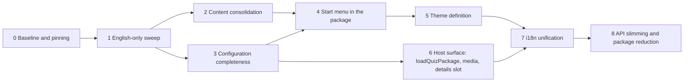

# H. Migration plan

Ground rules from the brief: the system stays runnable after every phase; behaviour is preserved and proven by the existing suites; no phase mixes a structural change with a rename; every phase names the packages it touches, what changes, dependencies, risks, tests and the visible result. Release cadence stays "fixed versions, 0.x" until Phase 8.

## Phase 0 – Baseline and pinning

**Goal.** A recorded, reproducible green state and fixed package ranges in every host, so every later phase can prove "behaviour preserved".

**Baseline as measured on 2026-09-14** (all six repositories at the HEADs listed in A.1):

| Repository | Unit | E2E | Red at baseline (pre-existing, cause known) |
|---|---|---|---|
| quiz `7e63233` | vitest 279/279 (20 files) | Playwright 98/100 | `kids-theme.spec.ts:103` (mascot overlaps the right buzzer since the user's `scale: 0.8` footer change in `Stage.module.css`), `touch-play.spec.ts:652` (zoom no longer read from the scene after the same change) |
| quiz-live `698b149` | vitest 68/72 (6 files) | Playwright 64/64 | `packages/server/test/media.test.ts` ×3 (`GET /media/<id>` answers 404 instead of 200/206/416: the test fixture asset is missing from the built package), `service.test.ts` "bevorzugt im naechsten Spiel noch nicht gespielte Fragen" (expected `[]`, got one repeated question: selection window vs. fixture size) |
| bundestags-app `084a545c` (new-quiz) | jest: 1 suite fails with 0 tests (CRA default `App.test.js`, not quiz) | Playwright 24/25 | `quiz.spec.mjs:481` "scales with the display size of the table" measures `0.7 / 0.9` because `STAGE_ZOOM` was set to `0.9` in commit `0c81f63a` while the test assumes the host runs at 1 |
| quiz-standalone `710bd12` | none | 4 (Electron; not runnable here: no `node_modules`) | unknown here |
| app-collection `56c6d5f` | vitest 3 | 3 (Electron; not runnable here) | unknown here |
| quiz-content-data `5fb94c8` | `quiz-content validate` (CI) | none | media missing (LFS), see README |

**Versions.** Published packages up to 0.15.3; quiz repo at 0.14.0 → 0.15.x; quiz-live devDependency `~0.14.0`; standalone, app-collection and bundestags-app `0.x`; bundestags-app lockfile 0.15.3 but **installed 0.6.1** (`node_modules/@hfroemmel/quiz-core/package.json`, no `quizModeSchema` in `dist/index.js`); quiz-content-data `^0.1.0`.

**Changes.** Fix or explicitly quarantine-with-issue the six red tests above (they are not flaky: all reproduce). Pin every host to `~0.15.3` (tilde, not `0.x`; the reasoning in `docs/veroeffentlichung.md` for `0.x` was "one hand, lockstep", which no longer holds once phases ship breaking minors). Add `content:build` to the bundestags-app CI so the four packages are regenerated from source instead of committed. Record the table above in each repo's README "Checks" section.

**Packages touched.** none. **Hosts.** all five. **Risk.** low. **Tests.** all suites green or listed. **Result.** the acceptance criterion for every later phase.

**Status: done** (branch `refactor` in all six repositories). The six red tests were fixed without loosening an assertion: the touch stage keeps the scene above the fixed footer and reads the zoom again (`Stage.module.css`), quiz-live got the 19 missing fixture assets plus a unique id for the second video question and a repetition test that no longer assumes a single candidate, and the bundestags-app zoom test now measures against the host's own `--quiz-start-zoom`. Every host pins `~0.15.3`, quiz-live stays `~0.14.0` until it is migrated. Measured green: quiz 279 unit + 100 E2E, quiz-live 72 unit + 64 E2E, bundestags-app 25 E2E. Lockfiles were not re-resolved here - the registry is unreachable from this environment.

## Phase 1 – English-only sweep

**Goal.** No German in identifiers, comments, test names, fixtures or repo documents; German remains only in locale files and content.

**Scope (files with German comments or identifiers, uniform heuristic, string literals excluded):**

| Repository | Source files | with German | German test names | Markdown |
|---|---|---|---|---|
| quiz | 161 | 153 | 248 | 31 files, ~31 800 words (`docs/`, READMEs, changesets) |
| quiz-live | 73 | 68 | 115 | 5 files, ~1 750 words |
| quiz-standalone | 15 | 15 | 4 | 1 file, ~750 words |
| app-collection | 18 | 18 | 6 | 1 file, ~660 words |
| bundestags-app (quiz paths) | 11 | 0 (one `$hell` variable, one "fassung" word) | 0 | `docs/quiz.md` already English |
| quiz-content-data | 0 | 0 | 0 | 1 file, ~900 words |

Exported German identifiers that hosts import and therefore need a deprecation alias for one release: `uebersetzteBeschriftung` (`packages/core/src/contracts/content.ts:94`), projection helpers `spracheFuer`, `beschriftung`, `untertitel`, `fragenTextFuer`, kiosk `klemmeZoom`, host-side `Betriebsangaben`, `bauePaket`, `ladePaket`, `liesStand`, `schreibStand` (preload bridge names cross the Electron IPC boundary in standalone and app-collection).

**Changes.** Rename identifiers with codemods (ts-morph), rewrite comments, translate test names and docs, keep the *content* of comments (they carry design decisions). Locale JSON values, `content/**` and expected UI strings in tests stay German. Translated docs keep their file names for one release with a one-line redirect, then are renamed.

**Packages touched.** all five. **Hosts.** all. **Dependencies.** Phase 0. **Risk.** medium (volume, ~150 files in quiz alone); mitigated by codemods and by doing it as one PR per repository with no behaviour change. **Tests.** full suites; screenshot baselines unchanged. **Result.** every later diff is readable without a dictionary and reviewers can enforce "English only" in CI with the heuristic script from this analysis.

**Status: done.** Identifiers were renamed through the TypeScript language service so that every reference followed: 562 symbols in quiz, 175 in quiz-live, 109 in quiz-standalone, 139 in app-collection. Renamed package exports keep a deprecated alias for one release, and the sheet-import CLI still accepts the former mapping keys `spalten`, `vorgaben`, `werte`. Comments, test titles, CI notes, SQL notes in the migrations and the documents are English; the harness serves the package under `/quiz-package/` and three harness files carry English names. German stays where it is content or user-visible: locale files, operator and player labels, the expected-text assertions that match them, the server's console banner, the editorial column names and the difficulty aliases `leicht/mittel/schwer`. The heuristic now reports German outside string literals in 6 of 154 quiz files, 13 of 73 quiz-live files and 2 of 15 and 18 files in the two Electron apps - every one of them a quoted UI label. Suites after the sweep: quiz 279 unit + 100 E2E + package verification, quiz-live 72 unit + 64 E2E, both Electron apps unchanged (no dependencies installable here). The configuration file of app-collection is now `collection.config.json`; the former name is still read so that a device set up earlier keeps its settings.

## Phase 2 – Content consolidation

**Goal.** One import pipeline, one canonical corpus repository, one customer format.

**Changes.**
- `quiz-content`: `template` (Excel workbook, D.2) and `import --xlsx|--csv` with per-locale column groups; reuse `SheetMapping`; `migrate-legacy` learns `img_credits` → asset `credit` and `info` → `explanation.details`, three-option questions pass (`minChoiceOptionCount` is 2).
- `quiz-content-data`: import the Bundestags-App corpus (162+168 adults, 60+53 kids) as new pools/audiences with `translations` where a German and an English row are the same question (editorial pairing; unpaired rows stay single-locale), images into LFS with credits.
- bundestags-app: `scripts/build-quiz-content.mjs` and `src/components/Quiz/content/source/*.js` are deleted; `content.lock.json` + `quiz-content pull` replace the four committed packages; the host selects the audience by filtering `quizzes` (not by loading a different package).

**Packages touched.** content, core (schema unchanged; `explanation.details` now populated by the pipeline). **Hosts.** bundestags-app, quiz-content-data. **Dependencies.** Phase 1 (English CLI). **Risk.** editorial pairing of the two language corpora is manual work; the 21 asset-reference errors in quiz-live's content must be fixed rather than re-stamped. **Tests.** `quiz-content validate` in both profiles; workbook round-trip unit tests (template → fill → import → identical `questions.json`). **Result.** Step 1–2 of the practice test take one route.

**Status: the package part is done; the corpus part is not started.**

- `import-sheet --xlsx [--sheet]` reads an editorial workbook directly.
  `readWorkbook` is the reader: the zip container and enough XML to find the
  cells, without a dependency. Verified against the real 2026 sheet - 199 rows,
  not one cell differing from a hand-made CSV export of the same file, after a
  bug that is worth remembering: a styled but empty cell (`<c r="F2" s="11"/>`)
  read as an opening tag eats the cell behind it, and the row arrives shifted by
  one in a way that looks like data.
- `translations` in the mapping reads the column groups of further locales out
  of the same row. Two sheets would leave nothing saying which German question
  the English one belongs to; the pairing lives in the row.
- `migrate-legacy`: `info` becomes `explanation.details` (it used to be
  `summary`, which is the moderator's lead-in), the image credit was already
  going to the asset, and `Anmerkung` becomes a note of the report - it is one
  editor writing to another, not content.
- Three answer options pass, and a test says so.

Open: the workbook TEMPLATE (D.2), and the corpus itself - importing the
Bundestags-App questions into `quiz-content-data` with the editorial pairing of
the two language corpora, and the images into LFS. Neither is possible from
this environment: LFS is blocked here, and the pairing is editorial work, not a
rule. The route the corpus will take is in place and tested.

## Phase 3 – Configuration completeness

**Goal.** Everything a start menu shows is in the quiz package configuration.

**Changes.** `quizModeSchema` + `playerCounts`, `artworkAssetId`, `emphasis`, `order` (D.3); `config.rules` (D.5) with defaults equal to today's constants; `deriveStartMenu()` in core (F.2); server validation in quiz-live accepts the new fields; `QuizGame` reads `playerCounts` from the selected quiz when present (prop stays as fallback for one release).

**Packages touched.** core, content (validation of the new references). **Hosts.** quiz-live (config lines), standalone/app-collection (config lines instead of the `playerCounts` prop). **Dependencies.** Phase 1. **Risk.** low; additive. **Tests.** core unit tests for `deriveStartMenu` (empty `quizzes`, single audience, unavailable pool, locale fallback); quiz-live `quizModes.test.ts` extended. **Result.** a new quiz is one configuration entry in every host.

**Status: done.** `quizzes[]` carries
`playerCounts`, `artworkAssetId`, `emphasis` and `order`; `config.rules` carries
scoring, the phase timings, the joker switch, the idle timeout and the details
flag, each defaulting to the constant used until now. The engine reads scoring
and the joker switch through its context instead of importing constants, and
`resolveRules` is the single place that decides what "not configured" means.
`deriveStartMenu(config, catalog, locale)` returns offers in menu order with
their labels resolved, the player counts across all offers, the language list
and, per offer, whether it can be started right now - a missing pool is decided
in the configuration, an empty question set is handed in by the server
(`quizAvailability`). A package without `quizzes` offers its audiences, so the
model is never empty. Content validation checks the artwork reference and warns
about a duplicated player count and two quizzes on one menu position. `QuizGame`
reads the player counts and the idle timeout from the package where the host
passes no property.

Measured: 311 unit tests (32 new, of which 8 prove that a configured rule
actually reaches the game), 100 E2E, package verification for all five
packages. The `catalog.quizzes` entries and `catalog.rules` are additive, so the
E2E screenshots are unchanged.

In the hosts (after the release of 0.16.0, all four pinned to `~0.16.0`):

- **quiz-live** names `playerCounts`, `emphasis` and `order` on its five
  quizzes; the menu facts thus live in the content package instead of in the
  stage code.
- **quiz-standalone** no longer says `playerCounts={[1]}` in `App.tsx`. The
  seats are a key of `quiz.config.json` and travel through the main process
  into the window; where the key is absent, solo stays the default. Its
  configuration suite proves the route from the file to the two buzzers.
- **app-collection** hard-coded nothing and therefore only follows the pin: the
  package says what it offers, the start screen asks for the rest.
- **bundestags-app** drops `IDLE_TIMEOUT_MS`; its build script writes
  `rules.idleTimeoutMs` into the generated config, and the four committed
  packages are regenerated with it. The suite stays at 25 green.

What is not done in the hosts: the operator desk labels its correction buttons
from the `scoringRules` constant instead of the resolved rules, so a package
that configures `manualAdjustmentStep` would get a label that does not match
the step. (The other item of this list, quiz-live's deprecated `texteFuer`
import, is gone: the desk calls `textsFor`.)

## Phase 4 – Start menu in the package

**Goal.** The Bundestags-App start screen becomes `StartMenu` in quiz-react; `QuizGame` uses it; quiz-live's stage overview uses the shared `OfferOverview`.

**Changes.** Port `QuizStart.js`/`QuizStart.scss` (F.3) with the same data attributes; `--start-*` tokens only; `cqw` sizing under `--stage-zoom`; settings and exit as optional slots; `GameStart` deprecated; bundestags-app deletes `QuizStart.js`, `startOffers.js`, `QuizStart.scss`, the `MutationObserver` latch, `[data-game-start] { visibility: hidden }`, twelve locale keys; quiz-live deletes `quizArtwork.ts` and the five images (artwork moves to the content package assets).

**Packages touched.** react, kiosk. **Hosts.** all four. **Dependencies.** Phases 2 (artwork assets in content) and 3. **Risk.** medium: three suites assert menu markup (bundestags-app 8 start-screen tests, quiz-live 11 stage-overview tests, quiz kiosk tests); mitigated by keeping the attribute names. **Tests.** move the eight bundestags-app start-screen tests into quiz's E2E as package tests; quiz-live `stage-overview.spec.ts` unchanged. **Result.** kiosk, standalone, app-collection and the app show the same menu; the live desk keeps its form.

**Status: the menu is in the package; the two host cleanups are open.**
`StartMenu` takes the derived model and asks what the configuration offers -
quiz, player count, level - and every step with a single option falls away. The
offer cards carry the motif of the content, the emphasised quiz takes the whole
row. The start command follows the offer: a quiz type travels as its id, a
package without quiz types names audience and level as before. `GameStart`
keeps its old interface for one release and builds the model itself. The eight
start-screen tests of the media table now run here against the harness device
(`test/e2e/start-menu.spec.ts`), plus one the app did not have: that the three
steps fit on the device and the corner buttons stay hittable - the regression
the third step actually caused.

Two decisions differ from the plan above, both on purpose:

- **The component lives in quiz-kiosk, not quiz-react.** The selection, the
  settings window and the confirmation dialogs share one stylesheet and one
  card; splitting them would have duplicated that card. Phase 8 merges the two
  packages anyway, and no host needs the menu without the kiosk runtime.
- **The cards are buttons with `aria-pressed`, not native radio groups.** The
  package's existing selection is built that way and three suites assert it
  (quiz, quiz-standalone, app-collection); the media table's radio semantics
  would have rewritten all three for an interaction the package already solves.
  Tab reaches every card, space and enter trigger it.

Still open in the hosts, both after the next release: the bundestags-app
deletes `QuizStart.js`, `startOffers.js`, `QuizStart.scss`, the
`MutationObserver` latch, the `visibility: hidden` rule and its twelve locale
keys, and states its three quizzes as `quizzes` with `artworkAssetId`; quiz-live
gets the shared `OfferOverview` and drops `quizArtwork.ts` - that one waits for
Phase 2, because the artwork has to live in the content package first.

**Both host cleanups are done, and both are verified.** The packages of this
branch were built and linked into the hosts' `node_modules` - the state a
release will install - so the suites ran against the real new code rather than
against a promise.

- **bundestags-app** deletes `QuizStart.js`, `startOffers.js`,
  `QuizStart.scss`, the `MutationObserver` latch, the `visibility: hidden` rule
  and its fourteen `quiz-start-*` locale keys. Its three quizzes are `quizzes`
  in the generated content, with their motifs as assets of the package; the
  wording moves into `interfaceStrings`, word for word, so the table says what
  it said. `Quiz.js` declares which parts of the frame the app supplies itself
  (`chrome`) instead of hiding them, and the media resolution is the runtime's
  parameter now (Phase 6) rather than a patched method. The eight start-screen
  tests moved here; five stay there for what stays the host's business. 22
  green.
- **quiz-live** drops `quizArtwork.ts` and its five image imports: the motifs
  are assets of the content package, and `view.quizOffers` carries motif and
  `emphasis` beside name and subtitle. Two deviations from the plan, both
  deliberate: the per-card COLOURS stay, keyed by the quiz id in the stage's
  own stylesheet - in the hall the colour is what makes a card recognisable
  from the back row, and that is presentation of this room, not a property of
  the quiz; and the shared `OfferOverview` component is not built, because an
  announcement on a stage and a selection at a device share a card, not a
  component. 72 unit tests, 64 E2E green.

ONE WARNING FOR THAT STEP, which is why both cleanups had to be one commit
each: the menu carries the media table's data attributes, which its own screen
carried too. As long as both screens exist, `[data-quiz-start]`,
`[data-quiz-card]` and their neighbours match twice, and the app's suite fails
on an ambiguous selector. The pin therefore rose in the SAME commit that
deleted the old screen, not before.

## Phase 5 – Theme definition

**Goal.** A host passes one theme object; no copied colour values anywhere.

**Changes.** `ThemeDefinition`, `themeDefinitionSchema`, exported `bright`/`dark`/`kids` (G.2), role-named tokens with the old names emitted as aliases for one release, scoped emission on the quiz root, `typography.fonts`, `assets.wordmark`; `QuizProvider` in react; `useStageTheme` becomes a host helper choosing between `bright` and `dark`. Hosts: bundestags-app removes the eight SCSS literals; app-collection may keep its own chrome colours (they are host chrome, not quiz).

**Packages touched.** themes, react. **Hosts.** all. **Dependencies.** Phase 4 (menu consumes tokens). **Risk.** screenshot baselines: values do not change, only their source; a pixel diff would signal a real regression. **Tests.** quiz screenshot E2E unchanged; unit test that `themeVariables(bright)` equals today's `palette.css` values. **Result.** Step 4 of the practice test needs no package release.

**Status: the object and the provider are there; the role names are not.**
`ThemeDefinition` states a design once - base, world, overrides on the stage,
above it and in the menu, fonts, word mark, motion - and `resolveTheme` turns it
into the values the components read. The three built-ins are the worlds that
exist, and sixteen tests compare every value of theirs against the rule of the
generated stylesheet that carries it.

`QuizProvider` puts a theme on the quiz's OWN element, so two quizzes on one
page cannot recolour each other; the harness surface `/pair` shows two devices
in two designs and `test/e2e/theme.spec.ts` measures them. Two details had to be
got right for that:

- **A host theme has to win where the package's variant rules sit.** The light
  stage declares its colours on the stage element and the light menu on the
  device's root element; a declaration there beats an inherited value. The
  resolved theme is therefore written inline onto those two elements, and its
  base decides the variant - whoever designs a dark device has designed it dark.
- **The menu mirrors the stage AFTER the override.** `brightStartPalette` states
  that relationship as a reference taken once, when the module is read, so a
  host's own accent would have stayed outside the menu. `brightStartMirrors`
  states it as data, `resolveTheme` applies it to the resolved colours, and a
  test compares table and palette so neither can drift.

What is deliberately NOT done: the role rename of the token families (G.3). It
touches every stylesheet of the packages and belongs to that sweep; a host gets
one object now, in the vocabulary its own stylesheets already speak. The kids
assets and `--kids-*` also stay in the stylesheets of the world, because they
are drawings and not a palette, and `useStageTheme` stays a hook of the package:
a host theme already decides the variant, so nothing forces the switch yet.

## Phase 6 – Host surface

**Goal.** The three concerns every host re-implements move into the packages.

**Changes.** `loadQuizPackage(raw)` in core (replaces `bauePaket`/`buildQuizPackage` in three hosts); `media` resolver option on `LocalQuizRuntime` (replaces the `assetUrl` monkey-patch in `bundestags-app/src/components/Quiz/assets.js:82-94`); `renderAfterSolution` slot + `rules.showDetailsAfterSolution` (replaces `QuizDetails.js`, `detailsByPrompt`, `DETAILS_DELAY_MS`, `FADE_MS`); `QuizGame` props `chrome={{ brand, abort, settings }}` (replaces three `display: none` rules in `Quiz.scss`); public `surface` signal (`data-surface="light|dark"` on the quiz root) for hosts that recolour their own chrome. Optional: a `@hfroemmel/quiz-host-electron` package for the byte-identical main-process files of standalone and app-collection (`inhalt.ts`, `protokoll.ts`, `stand.ts`, `preload.ts`).

**Packages touched.** core, react, (new electron host package). **Hosts.** all. **Dependencies.** Phase 3. **Risk.** low per item; the details slot changes the public view model (adds `explanation.details` under a rule flag), which is additive. **Tests.** bundestags-app details tests move to quiz as package tests; app-collection unit tests for `loadQuizPackage`. **Result.** the bundestags-app `Quiz.js` shrinks to session + mount; the two Electron hosts share one main process.

**Status: the four items that were planned for the packages are done; the
Electron host package stays optional and open.**

- `loadQuizPackage(raw, { rootDir })` replaces the same twenty lines in four
  hosts; the harness reads its own package through it.
- `LocalQuizRuntime` takes a `media` resolver, so an application with its media
  in its own bundle no longer replaces a method of the content service from
  outside - a rename in the package would have broken that silently.
- `QuizProvider` takes `chrome`: which parts of the frame the host supplies
  itself. What it takes over is not rendered, instead of being hidden by three
  `display: none` rules that had to be kept in step with the package's markup.
  Deliberately on the provider and not on `QuizGame`, as the plan said: a host
  declares its frame in the same place as its design, and a `QuizScene` host
  (the live stage) can do the same.
- And `data-surface="light|dark"` on the quiz root and the stage element, for a
  host that recolours its own bar: `data-theme` names a world, and the
  children's paper is light too.

- And the details step, the item that changes the public view model: with
  `rules.showDetailsAfterSolution` the detail text of an explanation travels
  with the solution, and `DetailsStep` in quiz-react gives it its own card,
  placed by `QuizGame`. The rule flag had been in the configuration since
  Phase 3 with nobody reading it.

  The line the projection exists to draw moved, so it is written down where it
  is drawn: in a hall nothing of an explanation is public, because the moderator
  tells it; at a device nobody tells it, and only then, and only `details`, and
  only in the solution scene. Six unit tests hold that in both directions.

  Two things fell out of it that the host could not have. The times of the step
  stand in its stylesheet, and the component reads how long its way out lasts
  off its own element - the app carried a `FADE_MS = 220` and a comment asking
  whoever changed one to remember the other. And a card lying on the stage has
  a shadow token now (`--stage-cardShadow`) instead of a colour value in a
  component.

  `renderAfterSolution` on `QuizGame` is the escape hatch for a host whose room
  wants a different card: it is handed the text and the way onward, while the
  holding of the round and the withdrawn footer button stay in the package.

  The rule is global configuration, which made it the awkward thing to test: a
  suite that turns it on in the shared fixture content turns it on for every
  other suite. So the harness can override rules for one run
  (`/play?details=1`), and the generated fixtures carry a background on
  everything but the easy level - otherwise the case "no background, so no
  step" could not be reached from a test at all.

And in the host, where the step came from: the Bundestags-App gave it up. Gone
there are the panel, the lookup from question TEXT to background - the player
view carries no id, so the prompt was the only key both sides had - the
three-state flag, the subscription on the runtime, the two timers, the card in
the stylesheet and the rule that hid the quiz's own way onward. Instead the
background is content (`explanation.details`) and the room says what it is
(`rules.showDetailsAfterSolution`). `Quiz.js` is down to 172 lines and does
what its header always claimed: open the session, give it an area, take back
the exit. 22 of 22 end-to-end runs green against the packed packages.

It also brought a small find of its own: the app's generator wrote the
UNCHECKED question list to its file, because parsing stripped the field beside
the schema - while the manifest's checksum was computed over that same
unchecked list. Nothing is stripped any more, so the checked list is the
product and the checksum covers what the file holds.

Open: only the Electron host package, and it is marked optional in the plan -
the two devices cannot install it before a release, and their main processes
are small.

Measured: 348 unit tests (+6 for the background, +1 baseline guard), 120 E2E
green.

## Phase 7 – i18n unification

**Goal.** One place per text: content labels, interface strings with package defaults per locale, host chrome in the host.

**Changes.** quiz-react ships `de-DE` and `en-GB` defaults (`useInterfaceStrings`), so the 35 English overrides in the app's build script disappear (already removed with the script in Phase 2; here the package side lands); `SET_LOCALE` remains the switch; bundestags-app passes its language once and drops the four-package matrix; rejection reasons become localised keys (`start.rejected.no-questions`).

**Packages touched.** react, core (rejection codes). **Hosts.** bundestags-app, quiz-live. **Dependencies.** Phases 5 and 6. **Risk.** wording changes are visible; keep the German defaults byte-identical. **Tests.** E2E per locale in quiz (`i-de`/`i-en` screenshots exist), bundestags-app variants table shrinks from four packages to two locales. **Result.** D.7 holds in every host.

**Status: the package side is done; the hosts still carry their overrides.**

- `englishTexts` in quiz-react is the German set in English, and `textFor`
  picks it by the language of the running game. The content still wins over
  both - that is where a host words a screen its own way and where a third
  language arrives without a new program version. A region reads as its
  language (`en-US` gets English), an unknown locale falls back to German.
- The German defaults are untouched, byte for byte, as the phase demanded.
- The fixture content of this repository gave up its twenty English overrides;
  the test bench now shows the package's own English, and an E2E test reads it
  there AND checks that the content overrides nothing - a leftover would make
  the assertion pass for the wrong reason.
- One fix came with it: `StartMenu` asked for its texts without saying which
  language the game runs in, so the menu fell back to German however the
  content was configured. It reads `model.locale` now; the model always knew.

Open in the hosts: the media table states roughly fifty strings per English
package, of which only the ones in its own voice - the greeting, the word
"Quiz" as a step name - are still needed; and its four content packages
(audience × language) can become two, because the language is no longer a
property of the package. Both are host work and belong in one pass with the
`content.lock.json` route of Phase 2.

## Phase 8 – API slimming and package reduction

**Goal.** Four packages with the public surface of E.5; deprecated names removed.

**Changes.** merge quiz-kiosk into quiz-react (`QuizGame` re-exported from react since Phase 4); remove `GameStart`, old token names, `playerCounts`/`audience`/`idleTimeoutMs` props, `brandWordmarkUrl`, German aliases from Phase 1; release as the first breaking minor with a migration note per host (three lines each).

**Packages touched.** all. **Hosts.** all (import path change). **Dependencies.** everything above. **Risk.** low, mechanical. **Tests.** full suites; `packages:verify`. **Result.** the API in E is the whole API.

**Status: done in the packages; the four applications change one import line
each when they take the release.**

- `QuizGame`, `StartMenu` and `deviceStartMenu` are exported by quiz-react.
  `@hfroemmel/quiz-kiosk` points at the new place for one release - the same
  grace every renamed export here got - and its stylesheet is an empty file so
  that an unchanged import resolves instead of breaking a build. The rules
  travel in quiz-react's stylesheet, which a host showing a quiz already
  imports.
- The twenty former names are gone, and `GameStart` with them. Nothing in the
  four applications used any of them - checked before removing, not after.

AND THREE ITEMS OF THIS PHASE'S LIST ARE DELIBERATELY NOT DONE: `audience`,
`playerCounts` and `idleTimeoutMs` stay props of `QuizGame`, and
`brandWordmarkUrl` stays exported. The first three are properties of an
INSTALLATION and not of the content - which audience a device plays in, how
many people stand at it, how long it waits before ending a game nobody plays.
The content answers them where it can (`quizzes[].playerCounts`,
`rules.idleTimeoutMs`) and the props narrow it per device; removing them would
move a table's setting into the question set it shares with the hall. The word
mark as a file is what a host needs that shows the mark OUTSIDE the stage, and
the stage overview of the live quiz does exactly that.

Done in 0.20.0: `@hfroemmel/quiz-kiosk` is deleted. The four packages of E.5
are now the four packages that exist - the changeset set, the verification
script, the tag script and the typecheck no longer name a fifth. The pointer
lived for exactly the one release it was promised, and the applications take
the swap with the pin bump: `QuizGame`, `StartMenu` and `deviceStartMenu` come
from `@hfroemmel/quiz-react`, and its `styles.css` carries what the kiosk
stylesheet used to.

## Effort and order of value

| Phase | Effort (person-days, rough) | Value for "new quiz tomorrow" |
|---|---|---|
| 0 | 2 | prerequisite |
| 1 | 6–8 | none directly; unblocks reviewability |
| 2 | 5 | high (one content route) |
| 3 | 3 | high (one configuration) |
| 4 | 5 | high (one menu) |
| 5 | 4 | high (one theme object) |
| 6 | 4 | medium (host code disappears) |
| 7 | 3 | medium |
| 8 | 2 | cleanup |

Phases 2 and 3 can run in parallel after Phase 1; 5 and 6 can run in parallel after 4 and 3 respectively.
